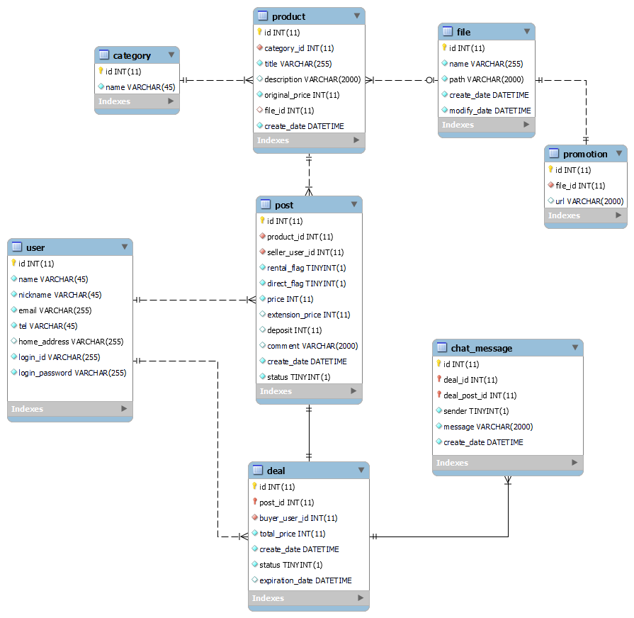

# GameRentalMarket

### 개요
- 제작기간: 2022.12 ~ 2023.02
- 1인 개발 프로젝트
- Spring을 이용하여 개인 간 게임대여 서비스를 만드는 프로젝트
- 웹사이트 주소: https://bit.ly/gamerental_test
- 상품/판매글 확인, 로그인, 회원가입, 판매글 추가, 거래신청, 판매/구매내역 확인, 거래진행, 프로젝트/상품/판매글 조회 API 등의 기능 구현
- 테스트 계정을 사용하거나(아이디: test / 비밀번호: test), 회원가입을 하여 서비스 이용 가능

### 프로젝트 동기
- 비싼 게임 가격에 부담을 느끼는 사례가 많은 한편, 반대로 게임을 사놓고 방치만 하거나 수집만 하는 사례도 쉽게 찾아볼 수 있다.
- 이런 서로 다른 문제점을 해결하기 위해 개인 간 대여 서비스를 기획하여 판매자 입장에서는 추가적인 수익을 얻고, 구매자 입장에서는 금전적인 이득을 볼 수 있도록 하는 서비스를 개발해보고 싶었다.
- 또한 혼자서 프로젝트 기획과 DB설계, 프론트엔드/백엔드 개발, 테스트, 배포의 처음부터 끝까지 경험해보고, 각각의 단계에서의 트러블 슈팅을 통해 개발 능력을 더욱 키워보고 싶었다.

### 웹사이트 주소
- 주소: https://bit.ly/gamerental_test ([API 명세](https://port-0-gamerentalmarket-1b5xkk2fldcqafwk.gksl2.cloudtype.app/swagger-ui/index.html))
- 판매글을 올리거나 거래신청을 하기 위해서는 로그인이 필요하며, 회원가입을 하거나 테스트 계정(아이디: test / 비밀번호: test)을 이용할 수 있다.

### 개발 환경
- IntelliJ IDEA
- Java 17
- Spring Boot (v3.0.1)
- PostgreSQL 
  - ElephantSQL 이용하여 DB 호스팅
- HTML, CSS, Javascript
  - Thymeleaf
  - Bootstrap (v5.2.2)
- 그 외
  - Spring Validation(회원가입, 판매글 작성 등에서 제약조건 검증 목적)
  - Spring Security(회원정보 DB 저장시 비밀번호 암호화 목적)
  - AssertJ, Lombok

### ERD

### 구현 기능
##### 1. 메인 페이지
- 전체적인 상품 목록과 프로모션을 확인할 수 있는 페이지
  

  
스크린샷/상세설명 확인

  

  - 1-1. 네비게이션 바(GNB)
    - 각 카테고리를 누르면 해당 카테고리의 상품만을 표시함
    - 로그인이 되어 있지 않다면 로그인 버튼이 노출되며, 로그인 상태라면 나의 거래정보와 로그아웃 버튼이 노출됨
  - 1-2. 프로모션
    - DB에 존재하는 프로모션 정보를 보여줌
    - 상품 관련 프로모션의 경우 클릭 시 해당 상품으로 이동
  - 1-3. 상품 목록
    - 모든/선택한 카테고리의 상품 정보 확인 가능
    - "빌려주기" 버튼을 클릭하면 해당 상품의 판매글 작성 페이지로 이동하며, "빌려쓰기" 버튼을 선택하면 해당 상품의 상세 페이지(거래 목록)로 이동함
    - 렌탈(게임 대여) 재고가 있을 경우 렌탈 최저가가 표시되며, 재고가 없을 경우 중고 최저가가 표시됨
    - 모든 재고가 없을 경우 "재고 없음" 문구가 노출됨
  - 1-4. 더보기
    - 추가 데이터를 가져오고 그 결과가 화면에 노출됨
    - 더 보여줄 데이터가 없다면 더보기 버튼은 사라짐
  

##### 2. 상세 페이지
- 상품의 정보와 거래글 목록을 확인할 수 있는 페이지
  

  
스크린샷/상세설명 확인

  

  - 2-1. 상품 정보
  - 2-2. 분류선택
    - 렌탈하기/중고구매 버튼을 클릭하면 해당 분류의 판매글 목록(2-3)이 표시됨
  - 2-3. 판매글 목록
    - 선택한 분류에 해당하는 거래글들이 표시되며, 직거래인 경우 판매자의 대략적인 주소도 함께 표시됨
    - 각각의 행을 클릭하면 해당 판매글에 대한 상세 정보와 구매신청 버튼이 표시됨
  

##### 3. 로그인
- DB에 있는 아이디와 암호화된 비밀번호 정보와 비교하여 로그인
  

  
스크린샷 확인

  
  

##### 4. 회원가입
- 아이디/닉네임 중복체크, 빈칸 체크, 이메일/휴대전화번호 양식 검증 후 DB에 저장
  

  
스크린샷 확인

  
  

##### 5. 판매글 등록
- 판매자가 되어 물건을 빌려주거나 중고로 판매할 때 이용하며, 양식을 작성하고 판매글 정보를 DB에 저장 (로그인 상태에서만 이용 가능)
  

  
스크린샷/상세설명 확인

  

  - 5-1. 물품정보
    - 판매할 상품의 정보 입력
    - 판매유형/거래방법 선택에 따라 입력 폼이 변경됨
    - 연장금액/보증금 선택은 선택사항
  - 5-2. 내 정보
    - 거래 상대에게 표시될 현재 로그인 사용자 정보
  

##### 6. 구매 신청
- 상대방이 올린 판매글에 구매신청을 할 때 이용하며, 양식을 작성하고 거래 정보를 DB에 저장 (로그인 상태에서만 이용 가능)
  

  
스크린샷/상세설명 확인

  

  - 6-1. 물품정보
    - 구매신청할 상품의 정보 확인
    - 렌탈의 경우 대여기간 선택 가능(판매자가 연장 불가 선택했을 시 대여기간 고정)
    - 대여기간을 선택할 때마다 총 가격이 변동됨 (총 가격 = 대여금액 + 연장금액 + 보증금)
  - 6-2. 내 정보
    - 거래 상대에게 표시될 현재 로그인 사용자 정보
  

##### 7. 판매 목록 확인 페이지
- 현재 로그인한 사용자의 판매 내역을 확인할 수 있는 페이지로, 올린 판매글을 삭제하거나 거래진행중 물품 등을 확인할 수 있음 (로그인 상태에서만 이용 가능)
  

  
스크린샷/상세설명 확인

  

  - 7-1. 판매 건수
    - 등록한 물품, 거래진행중 물품, 거래종료 물품의 개수 확인 가능
  - 7-2. 판매 탭
  - 7-3. 판매 정보
    - 각각의 행을 클릭하면 해당 글에 대한 상세 정보와 글 삭제/거래 진행 버튼 등이 표시됨
  

##### 8. 구매 목록 확인 페이지
- 현재 로그인한 사용자의 구매 내역을 확인할 수 있는 페이지로, 거래진행중 물품 등을 확인할 수 있음 (로그인 상태에서만 이용 가능)
  

  
스크린샷/상세설명 확인

  
  

  - 8-1. 구매 건수
    - 거래진행중 물품, 거래종료 물품의 개수 확인 가능
  - 8-2. 구매 탭
  - 8-3. 구매 정보
    - 각각의 행을 클릭하면 해당 글에 대한 상세 정보와 거래 진행 버튼이 표시됨  
  

##### 9. 판매 진행 정보 페이지
- 거래가 시작된 뒤 판매자가 확인할 수 있는 페이지로, 구매자 정보를 보고 거래를 진행하거나 취소할 수 있음 (해당 상품의 판매자로 로그인 상태에서만 이용 가능)
  

  
스크린샷/상세설명 확인

  

  - 9-1. 판매 정보
    - 물품정보, 거래정보, 구매자 정보 확인 가능
  - 9-2. 판매 진행
    - 현재 거래 상태를 표시함
    - 렌탈/직거래, 렌탈/택배, 중고/직거래, 중고/택배의 거래방법 별로 서로 다른 판매절차가 노출됨
  

##### 10. 구매 진행 정보 페이지
- 거래가 시작된 뒤 구매자가 확인할 수 있는 페이지로, 판매자 정보를 보고 거래를 진행하거나 취소할 수 있음 (해당 상품의 구매자로 로그인 상태에서만 이용 가능)
  

  
스크린샷/상세설명 확인

  

  - 10-1. 구매 정보
    - 물품정보, 거래정보, 판매자 정보 확인 가능
  - 10-2. 구매 진행
    - 현재 거래 상태를 표시함
    - 렌탈/직거래, 렌탈/택배, 중고/직거래, 중고/택배의 거래방법 별로 서로 다른 구매절차가 노출됨
  

##### 11. 프로젝트, 상품, 판매글 조회 API
  - 링크: [API 명세](https://port-0-gamerentalmarket-1b5xkk2fldcqafwk.gksl2.cloudtype.app/swagger-ui/index.html)
    

    
스크린샷 확인

    
    

